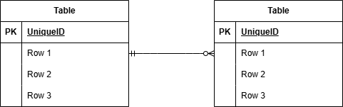

## アプリケーション名
お問い合わせフォーム FashionablyLate

## 環境構築
```  
１）リポジトリからダウンロード  
git clone git@github.com:ayaka-09eng/fukushima-kadai1.git  
  
２）srcディレクトリにある「.env.example」をコピーして 「.env」を作成し DBの設定を変更  
cp .env.example .env  
---  
DB_CONNECTION=mysql  
DB_HOST=mysql  
DB_PORT=3306  
DB_DATABASE=laravel_db  
DB_USERNAME=laravel_user  
DB_PASSWORD=laravel_pass  
---  
※.envが保存できない場合は以下コマンドを実行  
docker-compose exec php bash  
chown -R 1000:1000 .env  
  
３）dockerコンテナを構築  
docker-compose up -d --build  
  
４）Laravelをインストール  
docker-compose exec php bash  
composer install  
  
５）アプリケーションキーを作成  
php artisan key:generate  
  
６）DBのテーブルを作成  
php artisan migrate  
  
７）DBのテーブルにダミーデータを投入  
php artisan db:seed  
  
※The stream or file could not be opened"エラーが発生した場合  
srcディレクトリにあるstorageディレクトリに権限を設定  
chmod -R 777 storage  
```  

## 使用技術(実行環境)
PHP：8.1.33  
Laravel：8.83.8  
MySQL：8.0.26  
Ngnix：1.21.1  

## URL
お問い合わせフォーム：http://localhost/  
管理画面：http://localhost/admin  

## ER図
