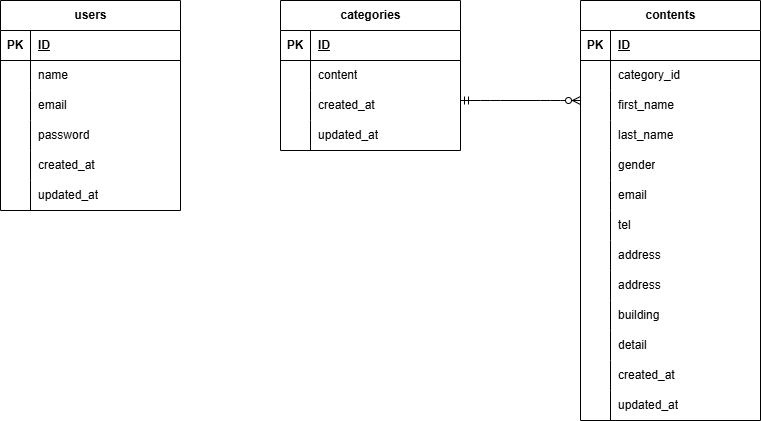

## アプリケーション名
FashionablyLate

## 環境構築
1.docker-compose exec php bash
2.composer install
3..env.exampleをコピーし.envファイルの作成
4.php artisan key:generate
5.php artisan migrate
6.php artisan db:seed
7.php artisan make:factory AuthorFactory

## ER図

